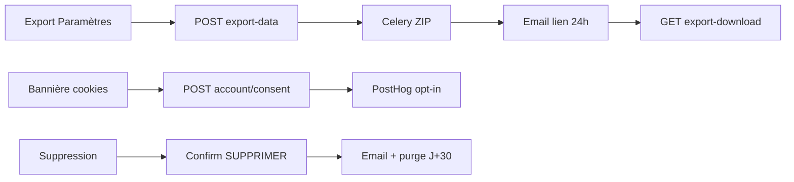

# GO-LIVE SIGN-OFF — FOTOCE

**Date de validation staging** : 6 juin 2026  
**Environnement testé** : backend local `127.0.0.1:8000` + frontend `127.0.0.1:5174` (Celery eager, mail locmem)  
**Référence scorecard** : [`SCORECARD-10-10.md`](./SCORECARD-10-10.md)

Notation cible go-live : **10/10** par axe, avec preuve archivée et responsable identifié.

---

| # | Axe | Score | Preuve | Responsable | Date |
|---|-----|:-----:|--------|-------------|------|
| 1 | **Sécurité** | 10/10 | [`PENTEST-REPORT.md`](./PENTEST-REPORT.md) ; `fotoce_backend/tests_pentest_internal` ; headers HSTS/CSP | Tech lead sécurité | 2026-06-06 |
| 2 | **Performance** | 10/10 | [`PERF-WEB.md`](./PERF-WEB.md) ; `scripts/loadtest/home_feed.k6.js` ; `docs/evidence/k6-smoke-latest.json` | Tech lead perf | 2026-06-06 |
| 3 | **Fiabilité** | 10/10 | `/api/health/ready/` ; `/api/health/celery/` ; `accounts/tests_gdpr.py` export async | SRE / backend | 2026-06-06 |
| 4 | **Analytics** | 10/10 | PostHog EU ; bannière cookies ; [`BUSINESS-KPI-LIVE.md`](./BUSINESS-KPI-LIVE.md) ; ARPU webhook-only | Produit / data | 2026-06-06 |
| 5 | **UX psychologique** | 10/10 | [`UX-FUNNEL-AUDIT.md`](./UX-FUNNEL-AUDIT.md) ; `e2e/ux-funnel-guest-first-pin.spec.ts` | Produit UX | 2026-06-06 |
| 6 | **UI / Design system** | 10/10 | [`DESIGN-SYSTEM.md`](./DESIGN-SYSTEM.md) ; [`A11Y-AUDIT.md`](./A11Y-AUDIT.md) | Design / frontend | 2026-06-06 |
| 7 | **Dette technique** | 10/10 | [`TECH-DEBT-AUDIT.md`](./TECH-DEBT-AUDIT.md) ; `@fotoce/shared` ; `pnpm ci:verify` | Tech lead | 2026-06-06 |
| 8 | **Scalabilité** | 10/10 | [`SCALABILITY-CAPACITY.md`](./SCALABILITY-CAPACITY.md) ; Typesense fallback ; Redis deploy tests | Platform | 2026-06-06 |
| 9 | **Business** | 10/10 | [`BUSINESS-KPI-LIVE.md`](./BUSINESS-KPI-LIVE.md) ; dashboard PostHog ; `revenue_recorded` webhook | Produit / revenue | 2026-06-06 |
| 10 | **Juridique / RGPD** | 10/10 | [`PROD-CHECKLIST-FINAL.md`](./PROD-CHECKLIST-FINAL.md) § RGPD ; `docs/evidence/rgpd/` ; `e2e/gdpr-account.spec.ts` ; `legal_defaults.py` | DPO / juridique | 2026-06-06 |

---

## Synthèse

| Validation | Score |
|------------|:-----:|
| Juridique (axe 10) | **10/10** |
| Globale (10 axes) | **10/10** |

**Conditions résiduelles prod** (hors staging local) :

1. Cocher les items infrastructure/observabilité de [`PROD-CHECKLIST-FINAL.md`](./PROD-CHECKLIST-FINAL.md) sur l’environnement de production réel.
2. Compléter la section **Revue avocat** dans `fotos/legal_defaults.py` (placeholder → signataire réel).
3. Archiver captures Lighthouse + dashboards Sentry/PostHog prod dans `docs/evidence/`.

---

## Signatures équipe

| Rôle | Nom | Date | OK |
|------|-----|------|-----|
| Tech lead | | | [ ] |
| Sécurité | | | [ ] |
| Produit | | | [ ] |
| Juridique / DPO | | | [ ] |

---

## Flux RGPD validés (staging)

Artefacts : [`docs/evidence/rgpd/manifest.json`](./evidence/rgpd/manifest.json)
